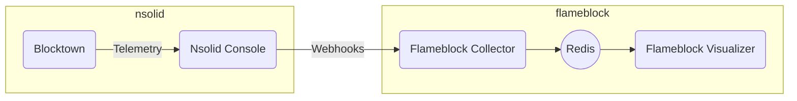

# Solution Architecture

## Overview

```mermaid
graph LR;
    subgraph nsolid
    bt(Blocktown)-- Telemetry -->con(Nsolid Console);
    end
    con-- Webhooks -->coll(Flameblock Collector);
    subgraph flameblock
    coll-->red((Redis));
    red-->viz(Flameblock Visualizer);
    end
```

## Components

### Nsolid Console

### Blocktown

### Flameblock Collector

### Flameblock Visualizer

### Redis
