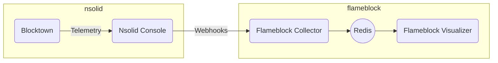

# Solution Architecture

## Overview



## Components

This proof-of-concept uses the [nsolid console](https://docs.nodesource.com/nsolid/3.4/docs#console-overview) and the [Blocktown sample application](https://github.com/snyk/sre-exercise-sample-app) to generate the data.

Flameblock itself consists of a collector and a visualizer, exchanging data using [Redis](https://redis.io/).

### Nsolid Console

The nsolid console is a component provided by Nodesource for use with their nsolid Node.JS runtime.

It allows agents deployed with nsolid-based applications to deliver telemetry as well as monitoring application behaviour in real time.

Further, it can be configured to deliver webhooks to external components when certain events occur. This capability is used here in combination with the Collector.


### Blocktown

Blocktown is a sample application which can be used to easily produce blocking event loops, triggering the console's webhooks.


### Flameblock Collector

The Collector receives incoming webhooks from the console. It analyzes the stack data breaks it down into a series of Redis keys. The blocked duration reported
in the webhook is added to these Redis.

In effect, Redis will store the cumulative amount of blocked time each observed stack frame was involved in over the collection period.

#### Example:
After ingesting these two stacks:
```
blockedFor: 507

foo (/foo.js:1:1)
bar (/bar.js:5:15)
baz (/baz.js:7:7)

```
```
blockedFor: 379

bat (/bat.js:4:14)
bar (/bar.js:5:15)
baz (/baz.js:7:7)

```

The data in Redis would reflect the total amount of blocked time for each of the four stack frames encountered:

```
/----------------------------------------------------------\
| foo (/foo.js:1:1) - 507ms  |  bat (/bat.js:4:14) - 379ms |
|----------------------------------------------------------|
|                  bar (/bar.js:5:15) - 886ms              |
|----------------------------------------------------------|
|                  bar (/baz.js:7:7) - 886ms               |
\----------------------------------------------------------/
```

### Flameblock Visualizer

The visualizer reads data from Redis and generates a JSON data structure used by the [d3-flame-graph](https://github.com/spiermar/d3-flame-graph)
javascript library. It also serves a static page which renders such a graph from that data.

The data format required by d3-flame-graph looks like this:
```
{
  "name": "<name>",
  "value": <value>,
  "children": [
    <Object>
  ]
}
```

In order to construct this data, the visualizer scans the entire Redis key space and builds a tree structure where each node represents a stack frame encountered by
the collector. The `name` represents the frame itself, the `value` is the total amount of blocked time this frame was involved in and `children` contains a subtree
with all frames that followed this one in any of the collected traces.


### Redis

Redis is a high-performance key-value store. It is used as the integration point between collector and visualizer, decoupling both components. Since it provides atomic
increments and non-blocking scan operations, it is well suited for this type of application.
