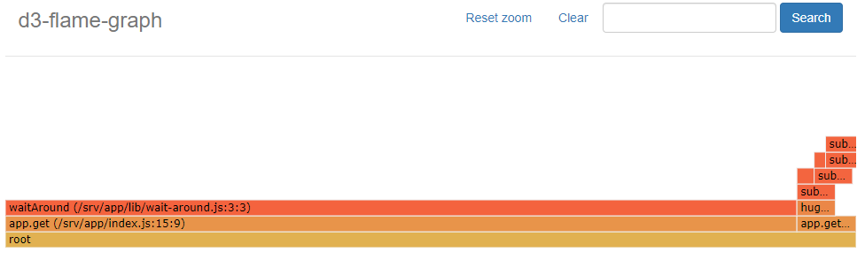

# Welcome to the Flameblock Documentation

## Introduction

Flameblock is a proof-of-concept attempt to make use of data provided by the nsolid Node.JS runtime environment on
blocked event loops for debugging purposes.

It uses the data captured from nsolid to generate [flame graphs](http://www.brendangregg.com/flamegraphs.html) which show
the relative amount of time spent blocked for each stack frame.

Nsolid delivers the information on blocked event loops as webhooks to external observers. These contain the blocked stack
as well as the amount of milliseconds the process was blocked.
In theory this information should be sufficient to generate useful flame graphs.

## Sample Data

In the example deployment, the data used was generated by running load tests against a [sample application](https://github.com/snyk/sre-exercise-sample-app) provided by Snyk.

## Outcome

It is immediately obvious that `waitAround (/srv/app/lib/wait-around.js:3:3)` was responsible for the vast majority of time spent blocked.

The graph could be a lot more helpful if the stack traces delivered by nsolid were complete.
Sadly I have not been able to find a way to increase the length of the stack delivered in the webhook from nsolid.

When nsolid generates stacks to include in its webhooks, it only seems to provide the top ten frames, truncating the rest.
The resulting graph is therefore not as useful as they could be:

Since flame graphs rely in common ancestry between the different nodes, they do not show the full picture when using truncated data like this.
Even though the different blocking calls most likely share a common ancestry all the way from the application entrypoint, this relationship is lost
in the results here.

In order to overcome this problem at least to some extent, I decided to provide two different data sources.
The first includes all stack frames as seen. This generates the second graph with no relationship between the different traces.

The second data source drops all stack frames including `node_modules`, effectively presupposing that identical stack frames in application code have the same
ancestry. This creates the first graph seen above.

{!docs/versioninfo.md!}
